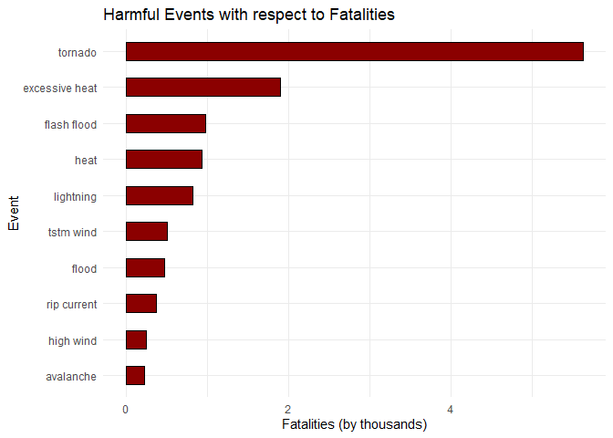
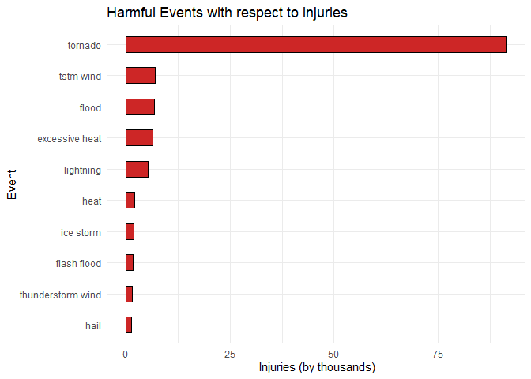
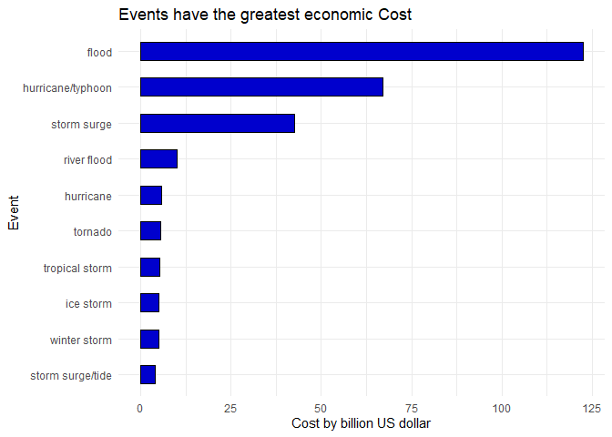

## Analysis Description
This data analysis address natural disasters effects on US economy and population , so will investigate the NOAA dataset from [National Climatic Data Center](https://www.ncdc.noaa.gov/) of USA to know total effects on both citizens and economics.and also, investigate which event from all natural disasters events has the greatest economics consequences  ?. And also , which event from all natural disasters events are most harmful to population health?

##Loading the required packages for the analysis

```r
library(ggplot2)
library(dplyr)
```
## Data Processing 
Download the data and loading it into R.

```r
#download the data from the link
if(!file.exists("NOAADataset.csv.bz2")){
    url <- "https://d396qusza40orc.cloudfront.net/repdata%2Fdata%2FStormData.csv.bz2"
    download.file(url, destfile= "NOAADataset.csv.bz2") }
#unzip the data and load the data read csv will handel the unzip of the file 
#bz2 is slow due to high comperssion so cacheing her is usefull
NOAADataset <-read.csv("NOAADataset.csv.bz2")
```
#### Subset the columns we needed for the analysis.

```r
names(NOAADataset)
```

```
##  [1] "STATE__"    "BGN_DATE"   "BGN_TIME"   "TIME_ZONE"  "COUNTY"    
##  [6] "COUNTYNAME" "STATE"      "EVTYPE"     "BGN_RANGE"  "BGN_AZI"   
## [11] "BGN_LOCATI" "END_DATE"   "END_TIME"   "COUNTY_END" "COUNTYENDN"
## [16] "END_RANGE"  "END_AZI"    "END_LOCATI" "LENGTH"     "WIDTH"     
## [21] "F"          "MAG"        "FATALITIES" "INJURIES"   "PROPDMG"   
## [26] "PROPDMGEXP" "CROPDMG"    "CROPDMGEXP" "WFO"        "STATEOFFIC"
## [31] "ZONENAMES"  "LATITUDE"   "LONGITUDE"  "LATITUDE_E" "LONGITUDE_"
## [36] "REMARKS"    "REFNUM"
```
We need only event type and each corresponding consequences on both public health and economy.

```r
colsName <- c("EVTYPE","FATALITIES","INJURIES","PROPDMG",
             "PROPDMGEXP","CROPDMG","CROPDMGEXP")
NOAASub <- subset(NOAADataset,select =colsName)
NOAASub$PROPDMGEXP <- as.factor(toupper(NOAASub$PROPDMGEXP))
NOAASub$CROPDMGEXP <- as.factor(toupper(NOAASub$CROPDMGEXP))
NOAASub$EVTYPE <- as.factor(toupper(NOAASub$EVTYPE))
```
Create Maping varible to PROPDMGEXP and CROPDMGEX to map them from symbols to numeric values.

```r
colsName <-  c("EVTYPE","FATALITIES","INJURIES","PROPDMG",
               "PROPDMGEXP","CROPDMG","CROPDMGEXP")
NOAASub <- subset(NOAADataset,select =colsName)
levels(NOAASub$CROPDMGEXP)
```

```
## [1] ""  "?" "0" "2" "B" "k" "K" "m" "M"
```

```r
levels(NOAASub$PROPDMGEXP)
```

```
##  [1] ""  "-" "?" "+" "0" "1" "2" "3" "4" "5" "6" "7" "8" "B" "h" "H" "K" "m" "M"
```
Now create varible by assigning values of symbols as same order of union output each symbol has value.   
"" ,"-" ,"?" ,"+" = 0 ,and the numeric's 10 to the power of the value for "" tricky symbol will convert it to char later.    
"K" for thousands,"M" for millions,"B" for billions, and "H" for hundreds ,then will name the varible elements as same order of union to map btween symbols and values.

```r
NOAASub$PROPDMGEXP <- as.factor(toupper(NOAASub$PROPDMGEXP))
NOAASub$CROPDMGEXP <- as.factor(toupper(NOAASub$CROPDMGEXP))
NOAASub$EVTYPE <- as.factor(toupper(NOAASub$EVTYPE))
decode <- c(rep(0,4),1,10,10**2,10**3,10**4,10**5,10**6,10**7,10**8,10**12
            ,100,10**3,10**6)
names(decode) <- as.factor(union(levels(NOAASub$PROPDMGEXP),levels(NOAASub$CROPDMGEXP)))
decode
```

```
##           -     ?     +     0     1     2     3     4     5     6     7     8 
## 0e+00 0e+00 0e+00 0e+00 1e+00 1e+01 1e+02 1e+03 1e+04 1e+05 1e+06 1e+07 1e+08 
##     B     H     K     M 
## 1e+12 1e+02 1e+03 1e+06
```
### assigning the numeric values insted of symbols.      
xpdecoder function which will handel the decode from symboles to numeric values by takeing each row from the dataframe column and convert symboles to numeric values.

```r
xpdecoder <- function(decodedvar){
    if(as.character(decodedvar)==""){
        var0 <- 0
    } else {
        var0 <-decode[as.character(decodedvar)]
        }
    return(var0)}
```
But the dataset dimensions too big to iterat twice. 

```r
dim(NOAASub)
```

```
## [1] 902297      7
```
So will reduce the dimensions by sum the rows according to the event ,CROPDMGEXP, and PROPDMGEXP to minmize the rows to make decoding more faster. 

```r
NOAASub <- aggregate(.~EVTYPE + CROPDMGEXP +PROPDMGEXP, data = NOAASub, sum)
dim(NOAASub)
```

```
## [1] 1580    7
```
Now can decode more faster after this reduction.

```r
NOAASub$CROPDMGEXP<- sapply(NOAASub$CROPDMGEXP, xpdecoder)
NOAASub$PROPDMGEXP<- sapply(NOAASub$PROPDMGEXP, xpdecoder)
```
After decoding now will multiply CROPDMGEXP and PROPDMGEXP to there corresponding columns
and drop CROPDMGEXP and PROPDMGEXP because there no more use to them in the analysis.

```r
NOAASub$CROPDMG <-as.numeric( NOAASub$CROPDMGEXP * NOAASub$CROPDMG)
NOAASub$PROPDMG <-as.numeric( NOAASub$PROPDMGEXP * NOAASub$PROPDMG)
NOAASub <- subset(NOAASub,select = -c(CROPDMGEXP,PROPDMGEXP) )
```
Now will sum the data over event type to make each event has single row,
Tthen sum the FATALITIES and INJURIES, to get which types of events harmful with respect to population health.
And, also sum the crop damge and properties damge, to get which types of events have the greatest economic consequences 

```r
NOAASub$EVTYPE <- as.factor(tolower(NOAASub$EVTYPE))
NOAASub <- aggregate(.~EVTYPE, data =NOAASub, sum)
NOAASub$HarmfulHealth <-rowSums(NOAASub[,c("FATALITIES","INJURIES")])
NOAASub$HarmfulEconomic <-rowSums(NOAASub[,c("CROPDMG","PROPDMG")])
```
      
## Results
### Total effects of events.

```r
Fatalities <-sum(NOAASub$FATALITIES)
paste("Total Fatalities near",round(Fatalities/10**3,2)," thousand citizen.")
```

```
## [1] "Total Fatalities near 15.14  thousand citizen."
```

```r
Injuries <- sum(NOAASub$INJURIES)
paste("Total Injuries near",round(Injuries/10**3,2)," thousand citizen.")
```

```
## [1] "Total Injuries near 140.53  thousand citizen."
```

```r
PropDmg <- sum(NOAASub$PROPDMG)
paste("Total properties damage cost around",round(PropDmg/10**12,2)," billion US dollar.")
```

```
## [1] "Total properties damage cost around 276  billion US dollar."
```

```r
CropDmg <- sum(NOAASub$CROPDMG)
paste("Total crops damage cost around",round(CropDmg/10**12,2)," billion US dollar.")
```

```
## [1] "Total crops damage cost around 13.65  billion US dollar."
```
     
### Events harmful with respect to population health.
Plot the top 10 event responsible for Fatalities and which has maximum Fatalities.

```r
TopFATALITIES <- subset(NOAASub,select = c(EVTYPE,FATALITIES))%>% 
                 top_n(.,10) 
```

```
## Selecting by FATALITIES
```

```r
g<-ggplot(TopFATALITIES, aes(x=reorder(EVTYPE,FATALITIES), y= FATALITIES/10**3)) 
(g + geom_bar(stat="identity",width=0.5, color="black", fill="red4")
   + coord_flip()
   + labs(title = "Harmful Events with respect to Fatalities") 
   + labs(x = "Event", y = "Fatalities (by thousands)")
   + theme_minimal()  )
```

<!-- -->

```r
toph <- TopFATALITIES[which.max(TopFATALITIES$FATALITIES),]
paste("The Most FATALITIES caused by",toph[[1]],"near",round(toph[2]/10**3,4),"thousand citizen")
```

```
## [1] "The Most FATALITIES caused by tornado near 5.633 thousand citizen"
```

Plot the top 10 event responsible for Injuries and which has maximum Injuries.

```r
TopINJURIES <- subset(NOAASub,select = c(EVTYPE,INJURIES))  %>% 
               top_n(.,10) 
```

```
## Selecting by INJURIES
```

```r
g<-ggplot(TopINJURIES , aes(x=reorder(EVTYPE,INJURIES), y= INJURIES/10**3)) 
(g + geom_bar(stat="identity",width=0.5, color="black", fill="firebrick3")
    + coord_flip()
    + labs(title = "Harmful Events with respect to Injuries") 
    + labs(x = "Event", y = " Injuries (by thousands)")
    + theme_minimal()  )
```

<!-- -->

```r
toph <- TopINJURIES[which.max(TopINJURIES$INJURIES),]
paste("The Most INJURIES caused by",toph[[1]],"near",round(toph[2]/10**3,4),"thousand citizen")
```

```
## [1] "The Most INJURIES caused by tornado near 91.346 thousand citizen"
```
            
### Types of events have the greatest economic consequences
Plot the top 10 event responsible for economic damage and which has maximum economic damage.

```r
TopEconHarm <- subset(NOAASub,select = c(EVTYPE,HarmfulEconomic))%>% 
               top_n(.,10)
```

```
## Selecting by HarmfulEconomic
```

```r
p<-ggplot(TopEconHarm , aes(x=reorder(EVTYPE,HarmfulEconomic), y= (HarmfulEconomic/10**12))) 
(p + geom_bar(stat="identity",width=0.5,color="black", fill="blue3")
   + coord_flip()
   + labs(title = "Events have the greatest economic Cost ") 
   + labs(x = "Event", y = "Cost by billion US dollar")
   + theme_minimal()  )
```

<!-- -->

```r
toph <- TopEconHarm[which.max(TopEconHarm$HarmfulEconomic),]
paste("The Most economic damage caused by" , toph[[1]] ,"around" ,round(toph[2]/10**12,4) ,"billion US Dollar")
```

```
## [1] "The Most economic damage caused by flood around 122.5278 billion US Dollar"
```


